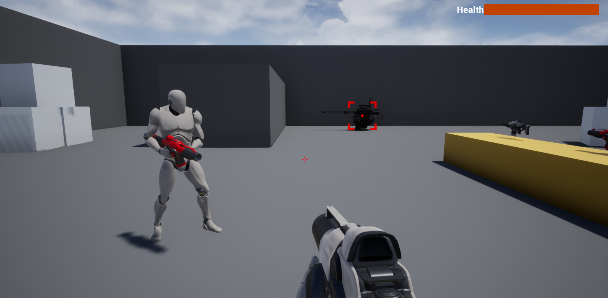

# FPS_Multiplayer_UE4

FPS Mulitplayer in Unreal Engine 4 in C++

Features : 
- Body replication for other player
- Auto aim
- Pickup weapon
- AI turrel
- Multiplayer
- Hover Car
- Enemies pointer widget
- HUD network serves list
- Weapon hit trace and bullet

 Auto aim

 Hover Car

 Multiplayer

 Servers list

